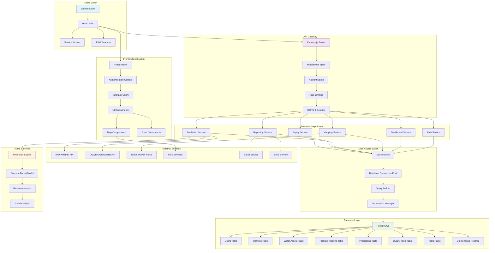
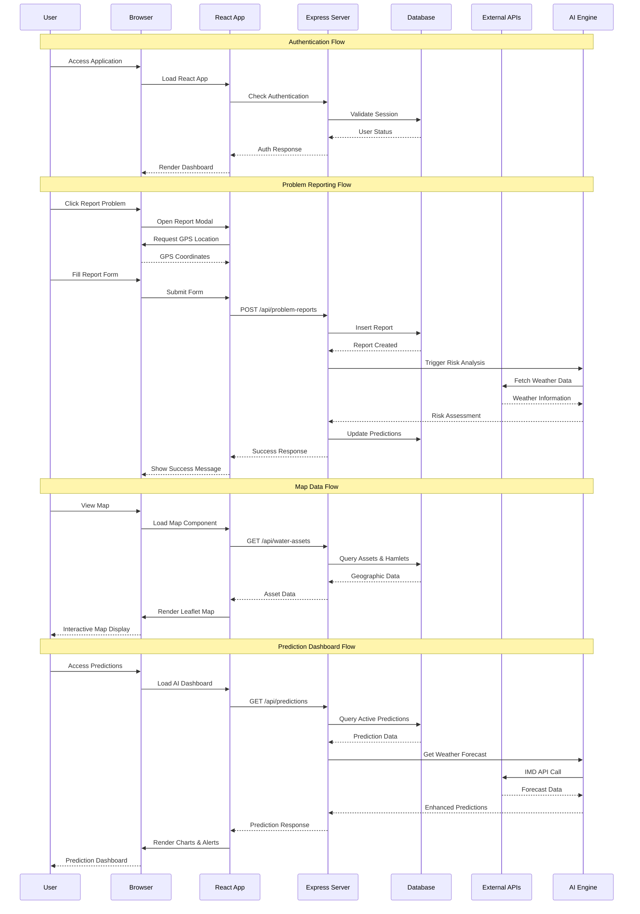
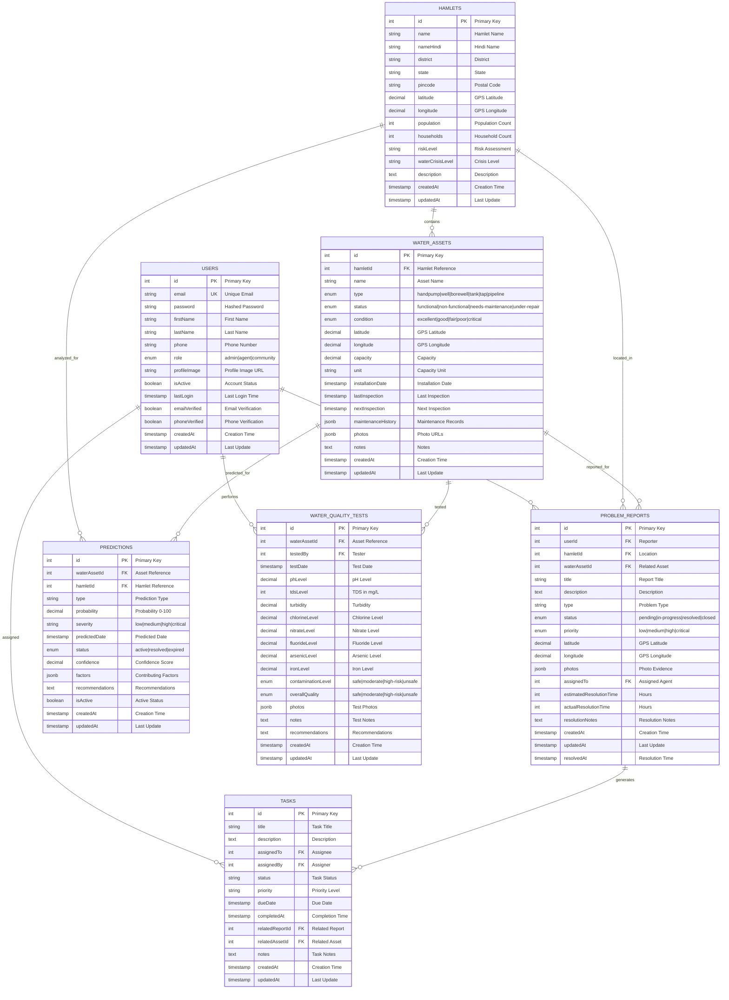
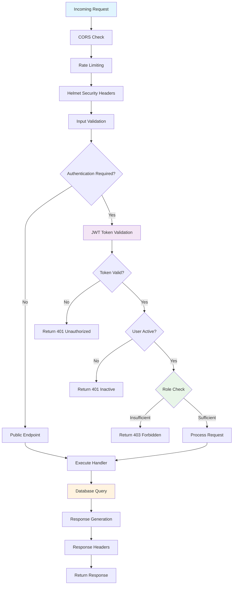
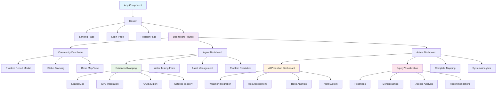
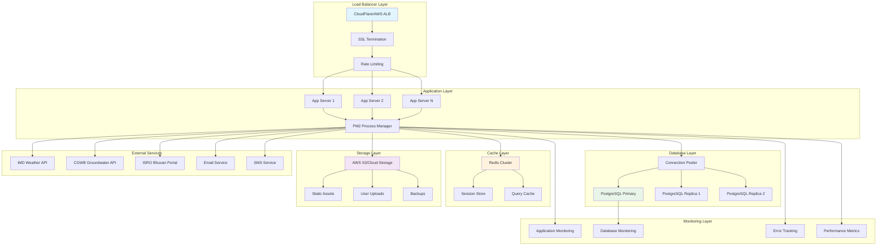
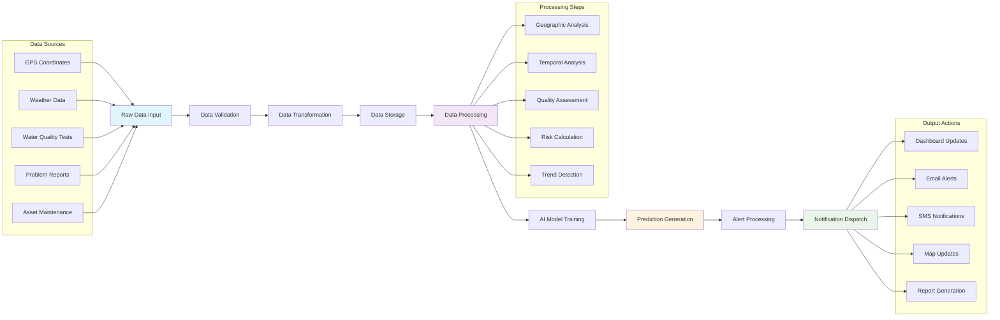

# Jal Drishti - Technical Implementation Architecture

## System Overview

This document provides a detailed technical implementation diagram for the Jal Drishti Rural Water Management Platform, showing the complete architecture, data flow, and component relationships.

## High-Level System Architecture

## Component Interaction Flow

## Database Schema Implementation

## API Endpoint Architecture

```mermaid
graph TD
    A[API Root /api] --> B[Authentication Routes /auth]
    A --> C[Dashboard Routes /dashboard]
    A --> D[Mock Data Routes /mocks]
    
    B --> E[POST /register<br/>User Registration]
    B --> F[POST /login<br/>User Authentication]
    B --> G[GET /profile<br/>Get User Profile]
    B --> H[PUT /profile<br/>Update Profile]
    B --> I[PUT /change-password<br/>Change Password]
    B --> J[POST /logout<br/>User Logout]
    
    C --> K[GET /stats<br/>General Statistics]
    C --> L[GET /user-stats<br/>User-specific Stats]
    C --> M[GET /admin-stats<br/>Admin Statistics]
    C --> N[GET /agent-stats<br/>Agent Statistics]
    
    D --> O[GET /hamlets<br/>Hamlet Data]
    D --> P[GET /water-assets<br/>Asset Data]
    D --> Q[GET /problem-reports<br/>Report Data]
    D --> R[GET /predictions<br/>Prediction Data]
    D --> S[GET /water-quality-tests<br/>Quality Test Data]
    
    style A fill:#e1f5fe
    style B fill:#f3e5f5
    style C fill:#e8f5e8
    style D fill:#fff3e0
```

## Security Implementation

## Frontend Component Architecture

## Deployment Architecture

## Data Processing Pipeline

This comprehensive implementation diagram shows the complete technical architecture of the Jal Drishti platform, including all layers from frontend to database, security implementation, deployment architecture, and data processing pipeline. The system is designed for scalability, security, and maintainability while addressing the four core problems in rural water management.

