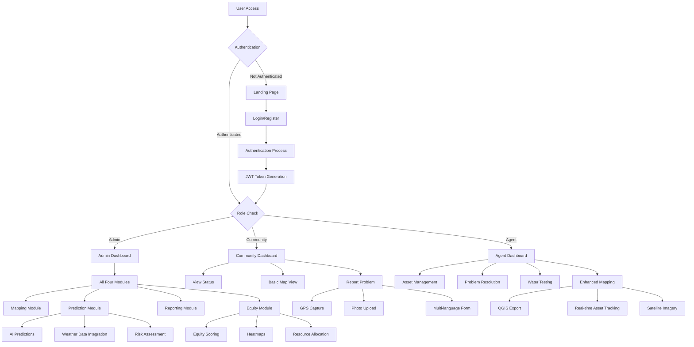
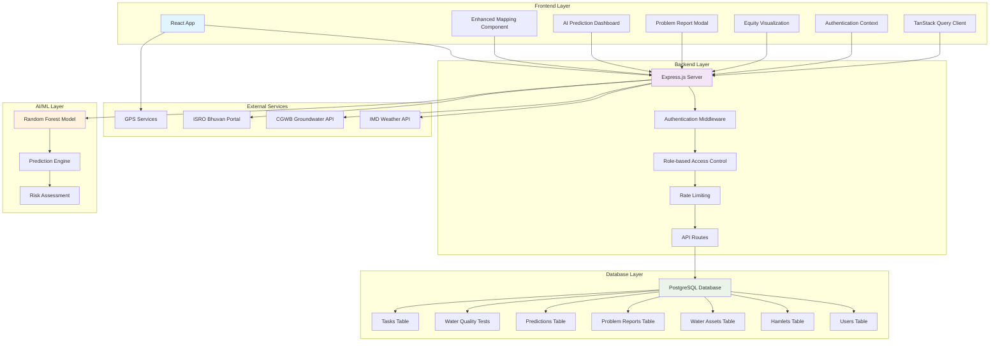
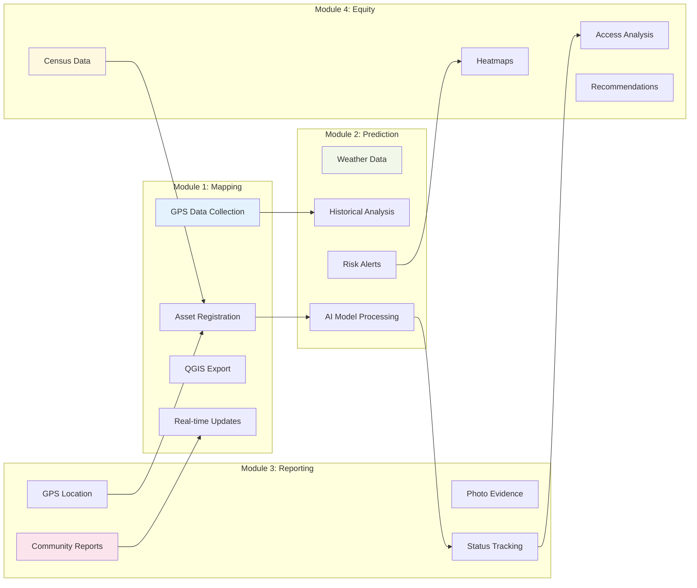
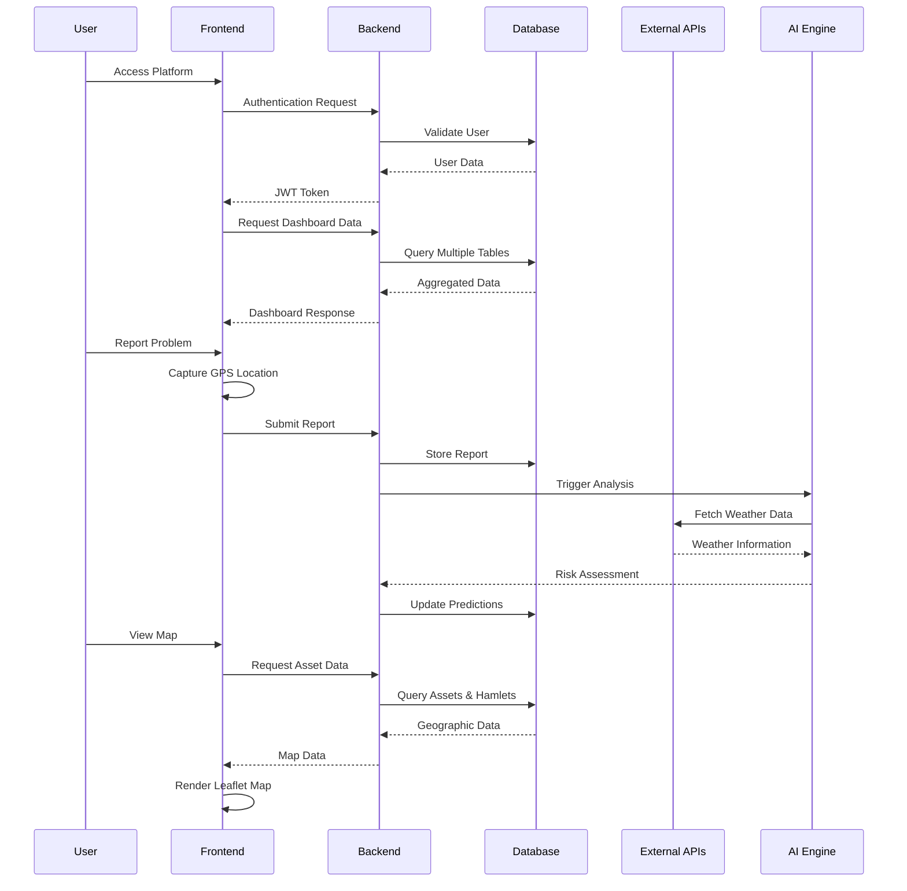
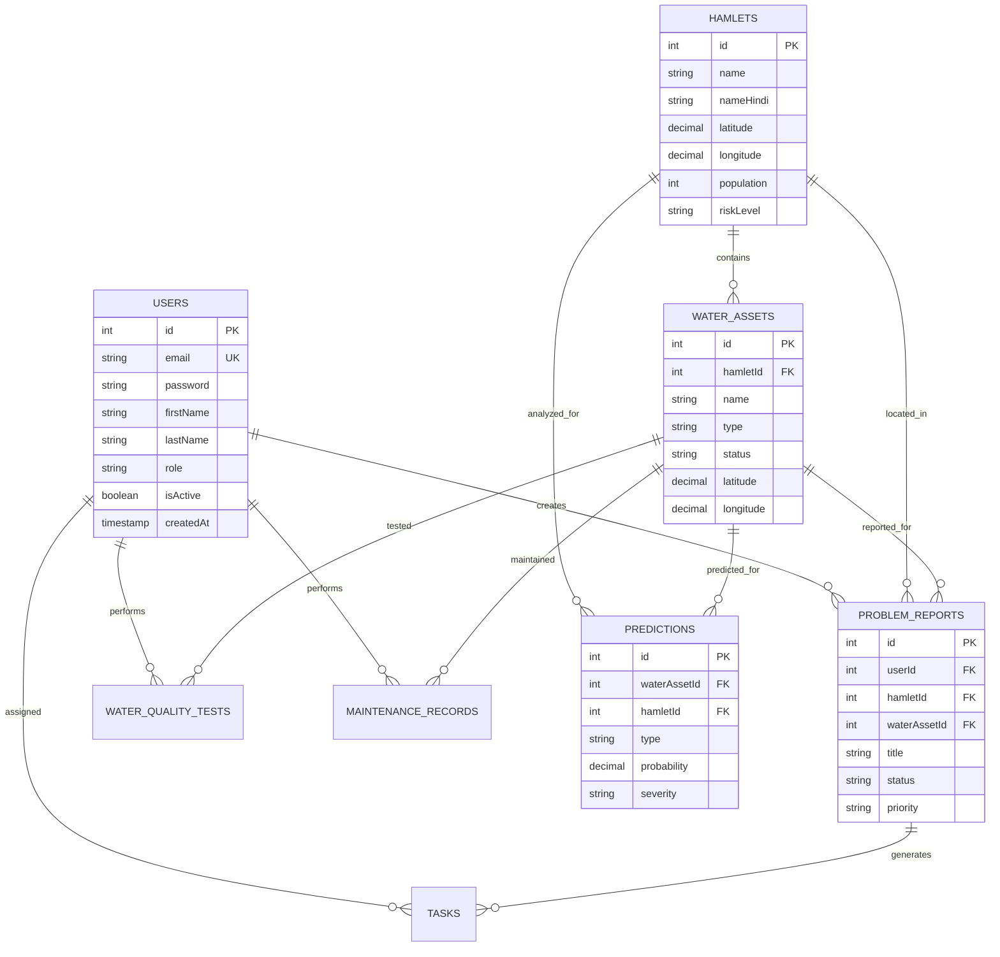
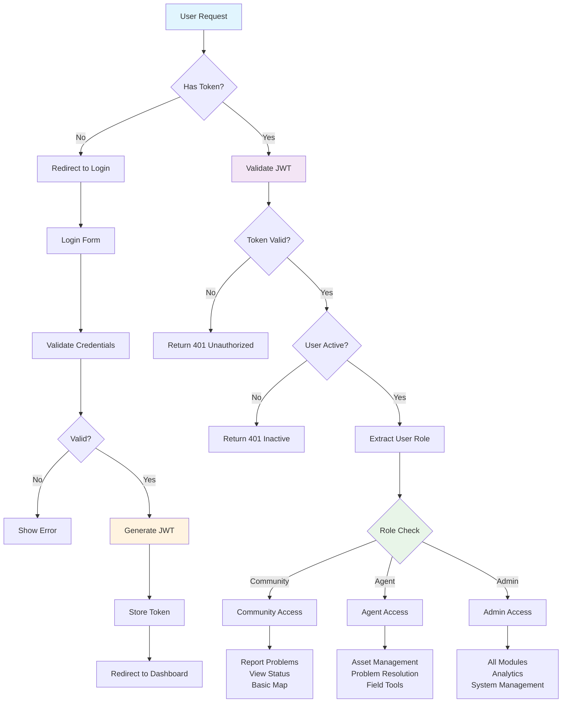
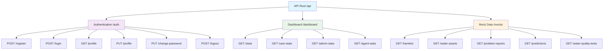
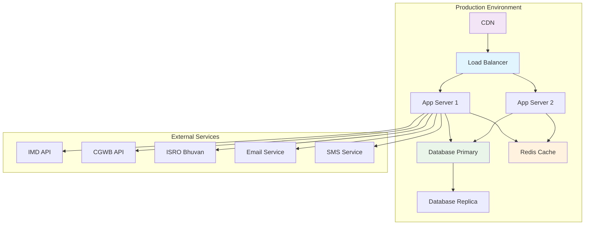

# Jal Drishti - Rural Water Management Platform Analysis

## Project Overview

**Jal Drishti** is a comprehensive Rural Water Management platform that addresses four critical problems in rural water management in India through interconnected modules providing real-time, hyperlocal, and predictive information for proactive and equitable resource management.

## System Architecture Analysis

### Core Problems Solved:
1. **Mapping Problem** - Unmapped Communities
2. **Prediction Problem** - Preventable Shortages & Contamination  
3. **Reporting Problem** - No Effective Way to Report Issues
4. **Equity Problem** - Unfair Distribution of Resources

### Technology Stack:
- **Frontend**: React 18 + TypeScript, Radix UI + Tailwind CSS, Leaflet.js
- **Backend**: Node.js + Express.js, PostgreSQL + Drizzle ORM
- **Authentication**: JWT-based with role-based access control
- **Deployment**: Vite build system, configurable for multiple platforms

## User Flow Diagram

## System Implementation Architecture

## Module Integration Flow

## Data Flow Architecture

## Database Schema Relationships

## Authentication & Authorization Flow

## API Endpoints Structure

## Deployment Architecture

## Key Features by User Role

### Community Members
- ✅ Report water problems with GPS location
- ✅ Track problem resolution status  
- ✅ View basic map of local water assets
- ✅ Multi-language support (Hindi/English)

### Field Agents
- ✅ GPS-enabled asset mapping
- ✅ Water quality testing and recording
- ✅ Problem resolution tracking
- ✅ Mobile-friendly interface for field work

### Administrators
- ✅ Complete system overview with all four modules
- ✅ AI-powered prediction dashboard
- ✅ Equity analysis and heatmaps
- ✅ Resource allocation recommendations
- ✅ Export capabilities for QGIS integration

## Technical Implementation Details

### Frontend Architecture
- **Framework**: React 18 with TypeScript
- **UI Components**: Radix UI primitives with Tailwind CSS styling
- **State Management**: TanStack Query for server state, React Context for auth
- **Mapping**: Leaflet.js with custom overlays and GPS integration
- **Forms**: React Hook Form with Zod validation
- **Routing**: Wouter for lightweight routing

### Backend Architecture  
- **Runtime**: Node.js with TypeScript
- **Framework**: Express.js with middleware stack
- **Database**: PostgreSQL with Drizzle ORM for type-safe queries
- **Authentication**: JWT with role-based access control
- **Security**: Helmet, CORS, rate limiting, input validation
- **API Design**: RESTful with consistent response format

### Database Design
- **Tables**: 8 core tables with proper relationships
- **Enums**: Type-safe enums for status fields
- **Indexes**: Optimized for geographic and temporal queries
- **Relations**: Foreign key constraints with cascade options
- **JSONB**: Flexible storage for photos and metadata

## Success Metrics & KPIs

### Technical Metrics
- **Prediction Accuracy**: Target 90%+ for water shortage predictions
- **Response Time**: <2 seconds for map loading, <5 seconds for reports
- **Uptime**: 99.9% system availability
- **Data Accuracy**: 95%+ GPS accuracy for asset mapping

### Social Impact Metrics
- **Coverage**: Map 100% of hamlets in target districts
- **Response Time**: <24 hours for critical problem resolution
- **Equity Improvement**: 20% reduction in underserved population
- **User Adoption**: 80%+ community member participation

## Future Roadmap

### Short-term (3-6 months)
- [ ] Photo upload functionality
- [ ] Offline support for poor connectivity areas
- [ ] SMS-based reporting
- [ ] Voice input support

### Medium-term (6-12 months)
- [ ] Advanced ML models for better predictions
- [ ] IoT sensor integration
- [ ] Native mobile applications
- [ ] Blockchain for transparent resource tracking

### Long-term (1-2 years)
- [ ] AI chatbot for multilingual support
- [ ] Predictive maintenance systems
- [ ] AI-driven resource optimization
- [ ] Government policy compliance tracking